etcd-rover
============
etcd-rover is a 2 node etcd cluster helper base drbd and keepalived, which makes etcd becomes available in edge scenarios where hardware resources are scarce.

Architect
-----------


How etcd-rover work
-----------
1. etcd2 and etcd2's should be run by etcd-rover. etcd-rover will start keepalived and drbd once you start etcd-rover container in each node
2. drbd immediately establishes the connection between disk2 and disk3
3. keepalived starts preempting for master, if node1 becomes master, etcd-rover will set drbd with disk2 primary and then start etcd2 process.
4. if node1 down, node2 become master, etcd-rover will set disk3 primary and then start etcd2's in node 2

notes: drbd synchronous replication protocol. Local write operations on the primary node are considered
completed only after both the local and the remote disk write(s) have been confirmed.

### Components Operation


Container Image
----------
- [alaudapublic/etcd-rover](https://hub.docker.com/r/alaudapublic/etcd-rover)
- [alaudapublic/etcd-rover-config](https://hub.docker.com/r/alaudapublic/etcd-rover-config)
- [alaudapublic/drbd-load](https://hub.docker.com/r/alaudapublic/drbd-load)

build image
```
docker build -t etcd-rover-config:latest -f ./load-config.Dockerfile
docker build -t etcd-rover:latest -f ./Dockerfile
```

kubernetes static pod yaml
----------
file exists in [manifest/rover.yaml](./manifest/rover.yaml)  
User should provide two node's disk,ip,gateway,host name, and vip of keepalived.


Dependencies
---------
- drbd9 kernel module  

There are 2 ways install drbd
1. [manifest/rover.yaml](./manifest/rover.yaml) has an init container which can auto build drbd kernel module and load.
2. [User manual installation](https://linbit.com/drbd-user-guide/drbd-guide-9_0-en/#p-build-install-configure)

Limitations
----------
if node1 and node2 rolling restart in a short period of time. drbd replicate data operation not be completed in such period of time. etcd will lose data in such scenario.

